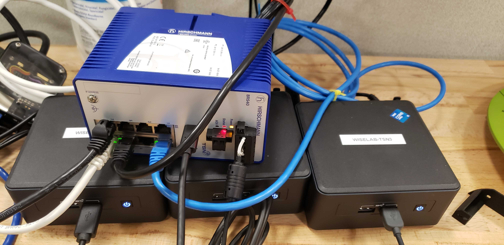
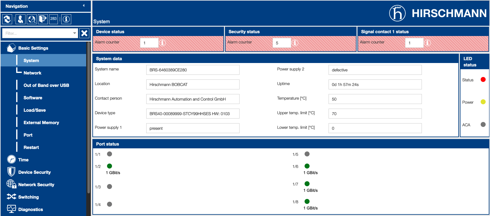

# TSN Switch Setup

These instructions are for configuring a Belden BOBCAT BRS40 managed layer 2 switch. The switch is TSN compatible, in that it implements several of the standards at the core of TSN.

These instructions will cover the GUI-based configuration.

## Contents

* [Guides/Documents from Belden/Hirschmann](#guides-and-documents-from-belden-and-hirschmann)
* [Setup](#switch-setup)
* Time Sync
* VLAN Configuration
* TSN TDMA-style QoS


## Guides and Documents from Belden and Hirschmann

[Hirschmann BOBCAT BRS User Manual](https://www.doc.hirschmann.com/pdf/IG_BRS20304050_02_1118_en_2018-11-15.pdf)
[Switch Operating System Version 8.X](https://catalog.belden.com/index.cfm?event=pd&p=PF_HiOS8BOBCAT)
[Hirschmann BOBCAT BRS40 Documents](https://catalog.belden.com/index.cfm?event=config&p=BRS40-8TX-EEC&c=Config215832)


## Switch Setup

### Hardware Setup 

Before anything else, the switch must be powered on. It takes a 12-24 V power supply, which should be provided as two wires to the screw-down recepticle near the top of the front panel. Ideally, two power supplies will be provided for redundancy, but the switch will still operate with one power supply (despite its warnings).

The image below shows the switch plugged into 3 NUC mini-PC endpoints (ports 2, 4, and 8) and a local router (port 7). The power supply is rigged to expose power and ground (white and black wires, resp.) for plugin to the terminals as shown.



Note that there is also a USB-C to USB-A cable connecting the switch to one of the NUCs. This cable is located between the status lights and the Ethernet ports, and is used for initial configuration before the switch is assigned an IP address

### Software Setup

The initial setup process involves logging into the switch using the default username (```admin```) and password (```private```), which must immediately be changed. This should be done from the Linux device with a USB connection to the switch.

Once logged in, you should see an interface like the one below:



This shows basic information like power-supply status (missing supplies will show as defective), a device name, uptime, port status, etc.

The settings are categorized hierarchically along the left side of the interface. Navigate to Basic Settings -> Software to view the current version of the operating system, HiOS. It should be at least 8.7; earlier versions may not have TSN features. Software may be updated by dragging the binary into the "Software update" box in the middle of this screen.


